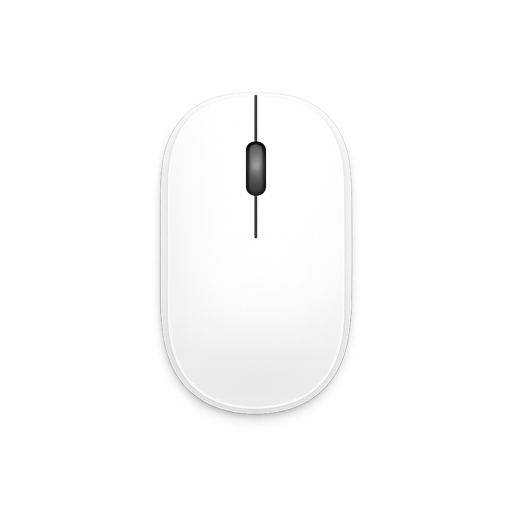

<div align="center">



# m-helper 👾

**A lightweight macOS menu-bar app that keeps your Mac “awake & active” by simulating natural mouse activity inside a screen region you choose.**

Move · Click · Scroll — at randomized, human-like intervals.


</div>

---

## ✨ Overview

**m-helper** lives in your menu bar (no Dock icon, no window clutter) and gently emulates real mouse usage so your machine looks busy — useful for keeping presence/idle indicators active, preventing screensavers, or any workflow where genuine-looking pointer activity matters.

You **draw a rectangle on screen**, pick a **mode**, set an **interval**, and hit **Start**. From then on m-helper performs the chosen action at a random point inside your rectangle, waiting a randomized amount of time between actions so the rhythm never looks robotic.

> [!NOTE]
> m-helper drives the **real system cursor** via `CGEvent`. It needs **Accessibility** permission (see [Permissions](#-permissions)). It’s designed to be honest, lightweight, and fully under your control — start and stop anytime.

---

## 🚀 Features

| | Feature | Description |
|---|---|---|
| 🎯 | **Pick a region** | Full-screen overlay — drag to select any rectangle. `Esc` cancels. |
| 🖱️ | **Move mode** | Jumps the cursor to a random point inside the region. |
| 👆 | **Click mode** | Performs a real left-click at a random point in the region. |
| 🌀 | **Scroll mode** | Scrolls a random amount (2–100 lines, random direction) at a random point. |
| 🎛️ | **Combined mode** | Runs all three on every tick. |
| ⏱️ | **Randomized timing** | Delay between actions is random `0…interval`, **biased toward the upper bound** — never a fixed metronome. |
| 🔁 | **Live mode switching** | Change the mode while running — it applies on the next tick, no restart needed. |
| ⌚ | **Adjustable interval** | 1–10 minutes, in 1-minute steps, right from the menu. |
| 🚀 | **Launch at login** | One-click autorun toggle (macOS `SMAppService`). |
| 💾 | **Remembers settings** | Mode & interval persist across launches. |
| 🪶 | **Featherweight** | Menu-bar accessory (`LSUIElement`), layer-backed overlay, single cancellable task, no leaks. |
| ⌨️ | **Shortcuts** | `⌘S` Start/Stop · `⌘Q` Quit. |

---

## 📦 Installation & Building

### Prerequisites

- **macOS 15.0+** (to run) and **Xcode** with a current macOS SDK (to build).
- **Xcode Command Line Tools** — needed by the build script (`xcodebuild`, `iconutil`, `hdiutil`, `SetFile`):
  ```bash
  xcode-select --install
  ```
- No third-party dependencies, package managers, or Apple Developer account required.

### Option A — Build a DMG and install (recommended)

```bash
# 1. Get the source
git clone https://github.com/steellson/m-helper
cd m-helper

# 2. Build the installer
./scripts/build-dmg.sh
```

The script is self-contained and does everything for you:

1. Compiles a **Release** build of `m-helper.app` (optimized, symbols stripped, no `.dSYM`).
2. **Ad-hoc signs** it so it runs locally without a Developer account.
3. Generates an `.icns` from the app icon and sets it as the **DMG volume icon**.
4. Packages a compressed **`build/m-helper.dmg`** containing the app + an `Applications` shortcut.

Then:

```bash
# 3. Open the installer
open build/m-helper.dmg
```

4. **Drag `m-helper` onto the `Applications` shortcut.**
5. Launch it from Applications/Spotlight. On first run, **grant Accessibility** when prompted
   (*System Settings → Privacy & Security → Accessibility → enable m-helper*) and relaunch — see [Permissions](#-permissions).
6. The 👾 mouse icon appears in your menu bar. You’re ready.

> [!IMPORTANT]
> The DMG is **ad-hoc signed** — it runs flawlessly on the Mac that built it (locally built apps aren’t quarantined by Gatekeeper). Redistributing the file to others over the internet would require Apple notarization. The intended flow is **clone & build yourself**.

### Option B — Run from Xcode

Open `m-helper.xcodeproj`, select the **`m-helper`** scheme, and press **▶ Run** (`⌘R`).
Best for development; use Option A to produce a real installable app.

### Option C — Build just the `.app` (no DMG)

```bash
xcodebuild -project m-helper.xcodeproj -target m-helper -configuration Release \
  CONFIGURATION_BUILD_DIR="$PWD/build/products" \
  CODE_SIGN_IDENTITY="-" CODE_SIGN_STYLE=Manual DEVELOPMENT_TEAM="" \
  build
# → build/products/m-helper.app  (drag to /Applications)
```

### Updating / rebuilding

```bash
git pull
./scripts/build-dmg.sh   # wipes and recreates build/, produces a fresh DMG
```

> [!TIP]
> After a rebuild the app’s signature can change, so macOS may ask for **Accessibility** again — just re-enable it.

---

## 🔐 Permissions

m-helper posts real mouse events, which macOS gates behind **Accessibility**:

1. On first launch the app requests it automatically (a system dialog appears).
2. Grant it in **System Settings → Privacy & Security → Accessibility** → enable **m-helper**.
3. Relaunch the app.

> [!WARNING]
> Without Accessibility permission, events are **silently ignored** — the app won’t crash, the cursor just won’t move. Also note that rebuilding the app can change its signature, after which macOS may ask for the permission again.

---

## ⚙️ Requirements

| | |
|---|---|
| **Run** | macOS **15.0+** |
| **Build** | Xcode with a current macOS SDK |
| **Language** | Swift 5 |
| **Frameworks** | SwiftUI, AppKit, CoreGraphics, ServiceManagement, ApplicationServices |

---

## ⚖️ Disclaimer

m-helper is provided as-is for personal, legitimate use on machines you own or are authorized to use. Simulating activity may violate the policies of some platforms or workplaces — use it responsibly and at your own discretion.

